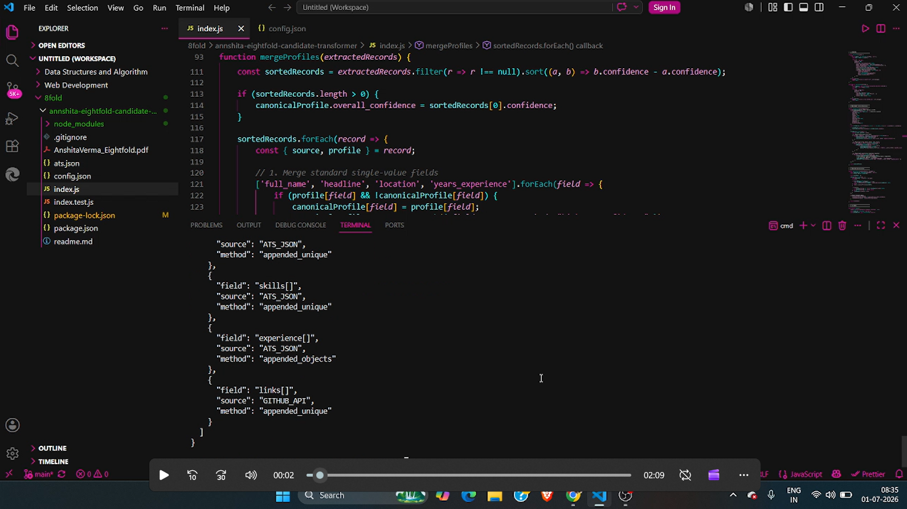

# Eightfold Candidate Data Transformer

An ETL pipeline and entity resolution engine that ingests structured and unstructured candidate data, normalizes it into a consistent format, resolves conflicts using deterministic confidence scoring, and produces a single high-confidence canonical candidate profile.

**Author:** Anshita Verma

# Eightfold Candidate Data Transformer

📄 **[Read the Technical Design Document](./AnshitaVerma_Eightfold.pdf)**

▶️ **Watch the demo video :**


**[](https://drive.google.com/file/d/1vtF25GlPhFXS-ntxZijt9ECxD2_RmaHP/view?usp=sharing)**

---

# Overview

Hiring platforms often receive candidate information from multiple sources such as ATS systems, GitHub profiles, resumes, and external APIs. These sources frequently contain incomplete, inconsistent, or conflicting information.

This project implements a complete ETL (Extract → Transform → Load) pipeline that:

- Extracts candidate information from multiple sources
- Normalizes data into standardized formats
- Resolves conflicting values using confidence-based entity resolution
- Tracks provenance for every resolved field
- Generates a canonical candidate profile
- Supports configurable runtime output projections without changing application code

The system is designed to continue processing even when individual data sources fail, making it resilient and production-friendly.

---

# Features

- Multi-source data extraction
- Deterministic entity resolution
- Confidence-based conflict resolution
- Data normalization
- Provenance tracking
- Runtime JSON projection
- Graceful failure handling
- Jest unit testing
- Modular architecture

---

# Tech Stack

- Node.js
- JavaScript (ES6)
- Jest
- GitHub REST API

---

# Project Structure

```
candidate-transformer/
│
├── extractors/
│   ├── atsExtractor.js
│   └── githubExtractor.js
│
├── transformers/
│   ├── normalizer.js
│   ├── merger.js
│   └── projector.js
│
├── tests/
│   ├── merger.test.js
│   └── normalizer.test.js
│
├── ats.json
├── config.json
├── index.js
├── package.json
├── README.md
└── .gitignore
```

---

# Data Processing Pipeline

```
ATS JSON
          \
           \
            ---> Extract ---> Normalize ---> Merge ---> Canonical Profile ---> Runtime Projection
           /
GitHub API
```

---

# Normalization

The transformation engine standardizes data before merging.

Examples include:

- Phone numbers → E.164 format
- Dates → YYYY-MM
- Skills → lowercase + deduplicated
- Emails → lowercase
- Empty values removed
- Arrays cleaned and deduplicated

---

# Entity Resolution

Each data source is assigned a confidence score.

Example:

| Source | Confidence |
|---------|-----------:|
| ATS | 0.90 |
| GitHub API | 0.70 |

Whenever conflicting scalar values exist, the engine chooses the value from the highest-confidence source.

Example:

ATS:

```json
"name": "Anshita Verma"
```

GitHub:

```json
"name": "Anshita V."
```

Resolved:

```json
"name": "Anshita Verma"
```

Array fields such as skills or emails are merged and deduplicated.

---

# Provenance Tracking

Every resolved field stores metadata explaining:

- Original source
- Resolution strategy
- Confidence used

Example:

```json
"_provenance": {
    "name": {
        "source": "ATS",
        "method": "highest_confidence"
    },
    "skills": {
        "method": "appended_unique"
    }
}
```

This makes every decision transparent and explainable.

---

# Runtime Projection

The system supports configurable output fields through `config.json`.

Example configuration:

```json
{
    "include": [
        "name",
        "email",
        "skills"
    ]
}
```

Changing the configuration changes the final output without modifying application code.

---

# Graceful Degradation

Each extractor is wrapped in error handling.

If:

- ATS file is unavailable
- GitHub API is unreachable
- Network requests fail

the pipeline logs a warning and continues processing remaining data sources instead of terminating.

---

# Prerequisites

- Node.js (v14 or higher)
- npm

---

# Installation

Clone the repository:

```bash
git clone <YOUR-GITHUB-REPO-LINK-HERE>
```

Navigate to the project directory:

```bash
cd candidate-transformer
```

Install dependencies:

```bash
npm install
```

---

# Usage

The project processes two default sources:

- Local `ats.json`
- Live GitHub API

Run the complete ETL pipeline:

```bash
node index.js
```

The application outputs:

- Canonical merged profile
- Runtime projected profile

---

# Running Tests

The project uses **Jest** to verify normalization and merge logic.

Run all tests:

```bash
npm test
```

---

# Core Design Decisions

## Deterministic Merge Policy

Instead of probabilistic record linkage, each source receives a fixed confidence score.

During conflicts:

- Highest confidence wins
- Arrays are appended and deduplicated
- Results remain deterministic and reproducible

---

## Provenance Tracking

Every field records:

- Source
- Merge strategy
- Resolution method

This provides complete explainability for every decision made by the merge engine.

---

## Graceful Degradation

Failures in one extractor do not terminate the application.

The system:

- Logs warnings
- Continues processing available sources
- Produces the best possible canonical profile

---

# Assumptions / Descoped

For simplicity:

- Object arrays (education, experience) are appended rather than deeply merged.
- Date normalization currently supports JavaScript-parsable dates.
- Complex textual dates such as:

```
Fall 2020
Spring '22
Q3 FY2021
```

would require a dedicated NLP-based date parser in a production implementation.

---

# Future Improvements

- Fuzzy matching using Levenshtein distance
- ML-based entity resolution
- Deep merge for education and experience
- Additional extractors (LinkedIn, Resume Parser)
- Configurable confidence scoring
- REST API interface
- Docker support
- CI/CD pipeline

---

# Git Initialization

Initialize a Git repository:

```bash
git init
```

Stage all project files:

```bash
git add .
```

Commit the project:

```bash
git commit -m "feat: complete data transformation pipeline and merge engine"
```

---

# Example Workflow

```
Extract Data
      ↓
Normalize Formats
      ↓
Resolve Conflicts
      ↓
Track Provenance
      ↓
Generate Canonical Profile
      ↓
Apply Runtime Projection
      ↓
Final JSON Output
```

---

# License

This project is intended for educational and assessment purposes.
```
